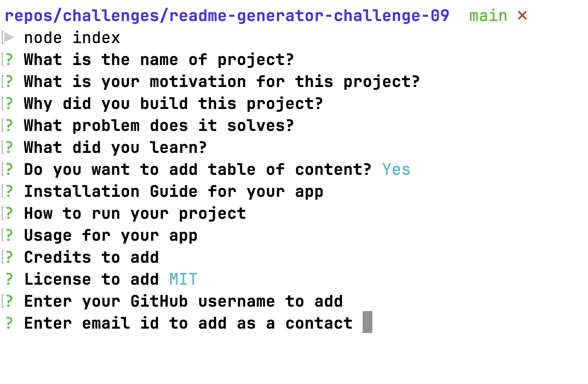

## Readme Generator     

## Description
* This project is built to help the user generate a README document.
* User can create README file for their project.
* Series of question is asked as follow:

* Based on the answer, a README file is created.
* With the completion of this project, I learned about node and npm.

## How to run the project
* Click on the following link to watch how to run video:

## Table of Content
1. [Installation](#installation)
2. [Run](#run)
3. [Usage](#usage)
4. [Credits](#credits)
5. [License](#license)
6. [Questions](#questions)

## Installation
Clone the project. Ensure node version 18 is installed. Use `npm install` to install the project dependencies.

## Run
To run the project use `node index.js`.

## Usage
User can generate a README document answering the series of questions.

## Credits
BootCamp course, class discussion and practice, [MDN](https://developer.mozilla.org/en-US/docs/Web/API/Node), [tl;drLegal](https://www.tldrlegal.com/)

## License

A short, permissive software license. Basically, you can do whatever you want as long as you include the original copyright and license notice in any copy of the software/source. There are many variations of this license in use.

## Questions

Should you have any question, you can reach me at 

[GitHub](https://github.com/salidamaharjan)

[Email Me](mailto:email@email.com)
